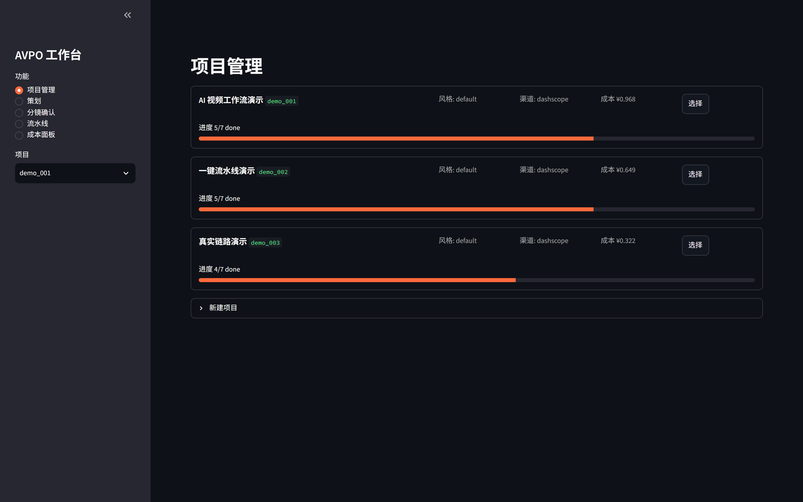
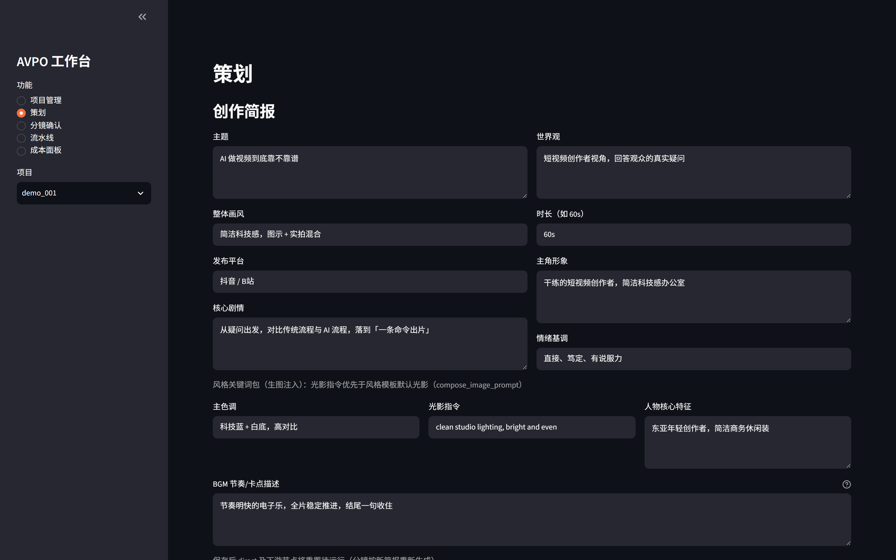
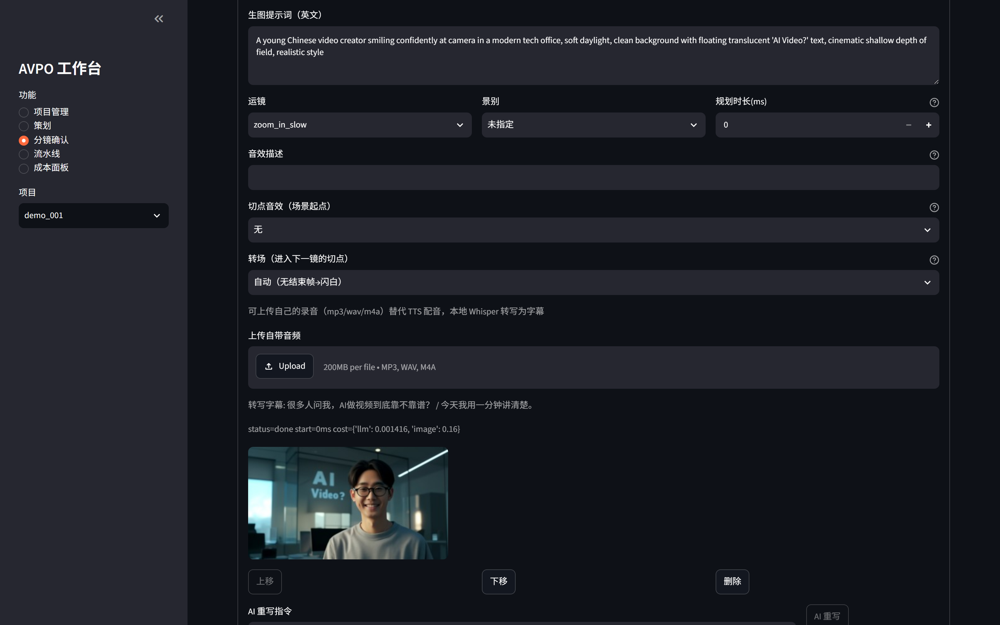
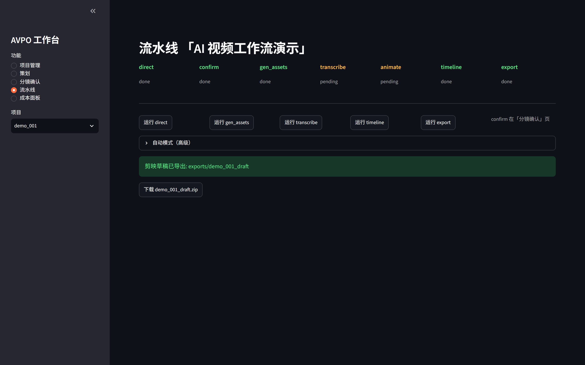

# AVPO — An AI Video Production OS

[中文](README.md) | **English**

[](https://github.com/niobium617/avpo/actions/workflows/tests.yml)
[](LICENSE)
[](https://www.python.org/downloads/)

> A smart middle layer connecting scripts, AI generation models, and CapCut (剪映) —
> eliminating manual shuttling and re-alignment between tools.
>
> **Creator-centric**: AI is a collaborator and proposer. What gets simplified is the
> toolchain, never the creative process — the human always holds the final cut.

**Status: M0–M11 complete** — the full pipeline from a one-line idea to an openable
CapCut draft (storyboard / voiceover & subtitles / candidate images / keyframe camera
motion / BGM beat-sync / transition damage-control / local Whisper subtitles /
multi-project Streamlit workbench). **357 tests green.**

## Screenshots

<p align="center">
  
  
</p>
<p align="center">
  
  
</p>

## How it works

```
One-line idea
   │ LLM (qwen-plus / DeepSeek-V3): shot breakdown, strict JSON + verbatim narration check
   ▼
Storyboard draft ──── human review (edit each shot / pick candidate / refine; --yes to skip)
   │ edge-tts: voiceover (word timestamps) + N candidate images per shot (Wanx / FLUX, seed-level cache)
   ▼
Assets archived → project.json updated (state + artifacts in ONE git commit = resumable runs)
   │ Subtitles = aggregated TTS timestamps, zero-cost alignment
   ▼
Camera-motion parsing (motion / start-end frames → keyframe plan, the `animate` node)
   │ End frame picked from existing candidates (0 extra image cost) → 0.4s static tail
   ▼
Timeline assembly (scene duration = real voiceover length, read via mutagen)
   │ pyJianYingDraft emits a plaintext CapCut draft (keyframe motion + styled subs + BGM)
   ▼
CapCut draft dir/zip → open in CapCut for the final polish → export
```

## Features

| Capability | Detail |
|---|---|
| Idea → storyboard | LLM returns strict JSON; narration is verified verbatim against the source |
| Voiceover + subtitles | edge-tts word timestamps aggregated into subtitles — free, already aligned |
| Candidate gallery | N images per shot (default 3); pick one, re-roll the seed, or refine via image-to-image |
| Creative brief | Subject / world / art style / reference images / BGM rhythm — the LLM proposes from it |
| Keyframe camera motion | zoom & pan fully keyframed in the draft; 0.4s static tail from a chosen end frame |
| Audio | BGM upload, beat detection with forward-only snapping, per-cut sound-effect binding |
| Transition damage-control | Cuts with no end frame auto get a 0.3s flash, overridable per shot |
| Local subtitles | Bring your own recording → local faster-whisper transcription, zero API cost |
| Workbench | Streamlit, five pages; task slots are per-project (same project serial, cross-project parallel) |
| CapCut draft export | Plaintext draft via pyJianYingDraft — open it and keep editing |
| Resumable | State and artifacts land in the same git commit; `kill -9` then re-run hits caches, 0 duplicate API calls |
| Style templates | `templates/*.json` = motion guidance + subtitle style + optional BGM |

## Quick start

```bash
# 0. Python >= 3.11 (developed and verified on Windows 11, CapCut 9.7.1 pinned)
python -m venv .venv
.venv/Scripts/activate            # Windows Git Bash; use .venv/bin/activate on POSIX

# 1. Install
pip install -e .                  # runtime deps + the `avpo` command

# 2. Configure a provider (needed for the asset pipeline)
cp .env.example .env              # fill in DASHSCOPE_API_KEY or SILICONFLOW_API_KEY

# 3. Run
avpo new proj_001 --title "AI product pitch" --style fast_talk
avpo run proj_001 --text "your script here..."          # shows the storyboard, asks to confirm
avpo run proj_001 --text "your script here..." --yes    # skip human review (automation / re-run)
avpo status proj_001                                    # node / scene / asset tree
avpo cost proj_001                                      # cost breakdown + over-budget warning

# 4. Graphical workbench
avpo web                                                # http://localhost:8501
```

## Providers

| Provider | Storyboard LLM | Images | Reference-image injection | Refine |
|---|---|---|---|---|
| `dashscope` (Qwen / Wanx) | qwen-plus | wanx2.1-t2i-turbo | ✅ wanx2.1-imageedit | ✅ |
| `siliconflow` (FLUX) | DeepSeek-V3 | FLUX.1-schnell | ❌ degrades to style-keyword mode | ❌ |

Rough cost per shot with 3 candidates: ~¥0.48 (Wanx) vs ~¥0.06 (FLUX). Voiceover
(edge-tts) and local Whisper transcription are free.

## Architecture

```
CLI (avpo) ──┐
             ├──> app/core/pipeline.py   node orchestration + downstream invalidation
Streamlit ───┘         │
workbench              ├── director/   script → storyboard (LLM, strict JSON)
                       ├── tts/        edge-tts voiceover + word timestamps + cache
                       ├── vision/     image generation, multi-provider, seed-level cache
                       ├── core/motion.py   single source of truth for camera motion
                       ├── audio/      BGM beat detection + local Whisper transcription
                       ├── timeline/   global timeline (real audio length + tails + sfx + beats)
                       └── export/     CapCut draft (pyJianYingDraft)
                              │
                              ▼
             data/projects/<pid>/project.json + assets/ + exports/<pid>_draft/
```

`project.json` is the single source of truth (pydantic schema, in-memory version
upgrades keep old projects loadable). `data/` is its own git repository: every save is
a commit, so run history and artifact state are versioned for free.

## Milestones

| Stage | What |
|---|---|
| M0 | Data layer + CapCut export proof of concept (draft opens in CapCut) |
| M1 | Asset pipeline: TTS, image generation, archiving, storyboard |
| M2 | End-to-end pipeline (one-command run + concurrency); 60s script ≤5min (measured 1.8min) |
| M3 | Robustness: resumable runs, cost ledger, error classification, style templates |
| M4–M5 | Streamlit workbench + background worker threads with real progress bars |
| M6 | Creator-centric flow: brief, candidate gallery, human review by default, edit API |
| M7 | Camera motion: `animate` node, four motion types fully keyframed, start/end frames |
| M8 | Audio: sound-effect library, per-cut binding, BGM beat detection and snapping |
| M9 | Transition damage-control: 0.3s flash/shake covering unfixable cuts |
| M10 | Local subtitles: bring-your-own-recording → local Whisper transcription |
| M11 | Workbench multi-tasking: per-project task slots (serial within, parallel across) |

## Known limitations

- Camera motion and shot types from the LLM are *proposals* — the keyframes in CapCut are
  what ships; transitions are fixed at 0.3s with no duration/curve tuning.
- Beat detection uses an energy envelope, so ambient or beat-less tracks yield few beats;
  BGM and sound-effect assets are yours to supply.
- Whisper's first run downloads a model (small ≈ 460MB); subtitles are one line per
  recognised segment and need a human pass. Recognised text is normalised to Simplified
  Chinese via OpenCC (`SIMPLIFY_CHINESE` to disable).
- The workbench allows one task per project. Multiple browser sessions starting tasks on
  the *same* project are not guarded by the UI.
- API keys live only in `.env` (git-ignored). No keys in the repository.

## Documentation

The design docs are written in Chinese (the project's primary language):

| File | Content |
|---|---|
| [README.md](README.md) | Full documentation — every milestone in depth |
| [EXECUTION_PLAN.md](EXECUTION_PLAN.md) | Overall plan and milestone definitions |
| [docs/PROGRESS.md](docs/PROGRESS.md) | Development log, milestone by milestone |
| [docs/versions.md](docs/versions.md) | Pinned dependency table |
| [docs/jyd_notes.md](docs/jyd_notes.md) | Reverse-engineering notes on the CapCut draft format |

## Contributing

```bash
pip install -e .[dev]
pytest          # full offline suite (tests marked `live` are skipped by default)
pytest -m live  # real external API path (needs provider keys in .env)
```

## License

[MIT](LICENSE) © 2026 niobium617
